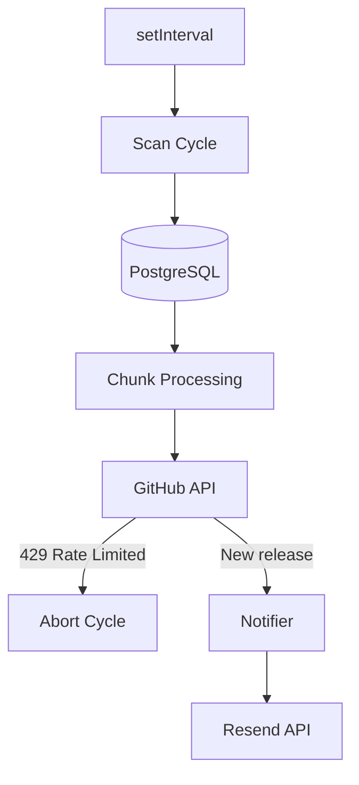

# ADR-001: Стратегія запуску сканера — єдиний таймер vs індивідуальний для кожного репозиторію

---

## Статус

**Статус:** Accepted
**Дата:** 2026-05-08
**Автор:** Яхній Олександр

---

## Контекст

Сервіс повинен регулярно перевіряти GitHub API на нові релізи для всіх підтверджених підписок. Потрібно було вирішити як організувати цей polling — одним спільним таймером або окремим для кожного репозиторію.

---

## Проблема

Як організувати polling GitHub API для всіх репозиторіїв, не перевищуючи rate limit (1000 req/год) і не створюючи зайвої складності реалізації?

---

## Розглянуті варіанти

### Варіант 1: Уніфікований сканер для всіх репозиторіїв

Один `setInterval` запускає цикл, який отримує всі підтверджені підписки з БД і перевіряє кожен репозиторій по черзі чанками.

**Плюси:**
- Один контрольований таймер — простіше керувати
- Простіше відстежувати помилки та логувати
- Легко зупинити весь цикл при rate limit (429)

**Мінуси:**
- При великій кількості репозиторіїв — пікове навантаження за один цикл
- При rate limit зупиняється увесь цикл, а не лише один репозиторій

---

### Варіант 2: Індивідуальний сканер для кожного репозиторію

Кожен репозиторій має власний таймер, який запускається незалежно.

**Плюси:**
- Навантаження розподіляється рівномірно протягом усього часу
- Падіння одного сканера не впливає на інші

**Мінуси:**
- Складно контролювати — N таймерів замість одного
- Важко відстежувати помилки та загальний стан системи
- При підписці/відписці потрібно динамічно створювати/зупиняти таймери

---

### Порівняльна таблиця

| Критерій                  | Уніфікований сканер | Індивідуальний сканер |
| ------------------------- | :-----------------: | :-------------------: |
| Простота реалізації       |         ✅          |          ❌           |
| Контроль стану системи    |         ✅          |          ❌           |
| Рівномірне навантаження   |         ⚠️          |          ✅           |
| Ізоляція rate limit       |         ❌          |          ✅           |
| Підходить для малого масштабу |      ✅          |          ⚠️           |

---

## Прийняте рішення

**Обрано:** Уніфікований сканер (Варіант 1)

---

## Причина рішення

Для поточного масштабу (3-5 юзерів, ~10-15 репозиторіїв) один сканер є достатнім і значно простішим у реалізації та підтримці. Rate limit обробляється через chunk-processing з ранньою зупинкою циклу при отриманні 429. У коді залишено TODO для додавання черги повідомлень при масштабуванні.

---

## Схема

---

## Наслідки

### Позитивні
- Простота реалізації та підтримки
- Один точок контролю та логування
- Легко зупинити через `clearInterval` при завершенні сервера

### Негативні
- При rate limit — увесь цикл зупиняється, частина репозиторіїв може не перевіритись
- При зростанні кількості репозиторіїв потрібно буде переходити на чергу (queue)

---

## Reviewer

**Reviewer:** Мої любімі одногрупніки

---

## Deadline

**Deadline:** 2026-05-08