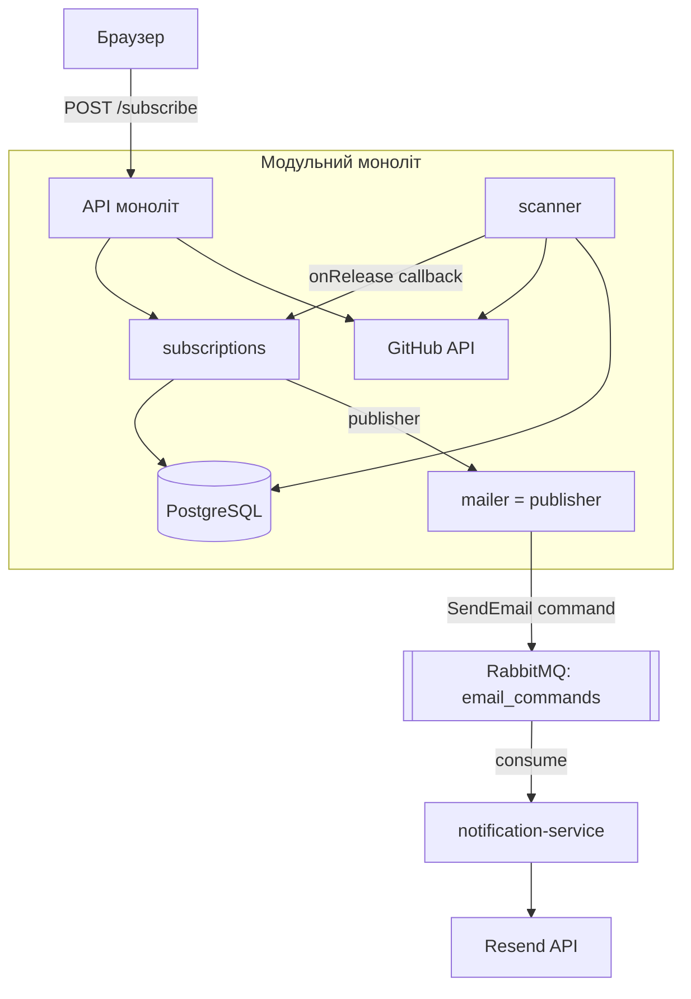

# ADR-002: Модульна архітектура та винесення нотифікацій у мікросервіс

---

## Статус

**Статус:** Accepted
**Дата:** 2026-06-05
**Автор:** Яхній Олександр

---

## Контекст

Застосунок був монолітом, організованим **за технічними шарами** (`controllers/`, `services/`, `repositories/`, `clients/`). Щоб зрозуміти одну фічу, доводилось стрибати по 4 теках — домен «розмазаний» по шарах.

Завдання HW#7: відрефакторити під принципи модульної архітектури — чітко розмежувати домени, визначити межі відповідальності та винести **щонайменше один домен** в окремий мікросервіс.

---

## Проблема

1. Як поділити код на домени з чіткими межами (high cohesion, low coupling)?
2. Який домен винести в мікросервіс — і чому саме його?
3. Як новий сервіс має спілкуватися з монолітом?

---

## Рішення 1 — Модульний моноліт (поділ за доменами)

Перейшли від поділу **за шарами** до поділу **за доменами** (vertical slicing). Кожен домен — самодостатня вертикаль; межа домену стала видимою як папка й видима в `import`-ах.

```
src/modules/
  subscriptions/   ← ядро (core domain): володіє users/repositories/subscriptions
  scanner/         ← виявлення нових релізів
  shared/          ← cross-cutting: github (ACL), db, config, auth, metrics, health, messaging
```

**Ключове спостереження про зв'язаність:** `scanner` і `subscriptions` не викликають один одного, але тримаються за **спільні таблиці БД**. Спільні дані — найсильніший вид зв'язаності (сильніший за виклик функції). Саме це визначило вибір у Рішенні 2.

---

## Рішення 2 — Який домен виносити

| Кандидат | Вердикт | Чому |
| --- | --- | --- |
| **notifications** | 🚀 **виносимо** | Не тримається за нашу БД (stateless). Вузький контракт (надіслати лист). Це supporting-домен, не ядро. |
| **scanner** | 📦 лишається модулем | Сидить на спільних таблицях із підписками. Винос = розрізати БД (дублювання даних + eventual consistency). Не виправдано. |
| **subscriptions** | 📦 ядро | Власник даних — серце застосунку. |
| **github client** | 📦 спільний модуль (ACL) | Тонка обгортка над зовнішнім API; винос = зайвий мережевий стрибок. Over-engineering. |

**Обрано: винести `notifications`.** Поверхня розрізу — це вже наявний інтерфейс `ConfirmationMailer & NotificationMailer` (Dependency Inversion): моноліт продовжує викликати той самий інтерфейс, ми лише підмінили реалізацію з «викликати Resend» на «опублікувати команду в чергу». Контролер і логіка розсилки **не змінились**.

---

## Рішення 3 — Спосіб зв'язку: асинхронно (черга), команди

### Синхронно (HTTP/gRPC) vs Асинхронно (черга)

| Критерій | Синхронно (gRPC/HTTP) | **Асинхронно (RabbitMQ)** |
| --- | :---: | :---: |
| Якщо поштовик лежить | підписка падає / лист губиться | ✅ команда чекає в черзі |
| Temporal coupling | сервіси мусять бути живі разом | ✅ незалежні в часі |
| Швидкість відповіді UI | чекаємо листа | ✅ одразу 200 |
| Складність | менша | + брокер, eventual consistency |

Лист — це **fire-and-forget**: нікому не важливо, що він прийде на 2с пізніше. Не хочемо робити core-флоу (підписку) заручником аптайму поштовика. **Обрано асинхронний зв'язок через RabbitMQ.**

> Контрприклад у тому ж потоці: перевірка існування репо через GitHub лишилась **синхронною** — бо відповідь потрібна *зараз*, щоб ухвалити рішення приймати підписку чи ні. Критерій: синхронно — коли потрібен результат, щоб продовжити; асинхронно — коли важливо лише, що дія колись станеться.

### Команда vs подія

Через мережу до сервісу їде **команда** (`SendEmail` типу `confirmation`/`release`), а не подія. Сервіс — тупий виконавець доставки, рішення «кому й що слати» вже ухвалене в моноліті (власником даних). Усередині моноліту scanner повідомляє subscriptions про реліз через **інжектований колбек** (`onRelease`) — scanner не знає ні про підписників, ні про пошту.

> Вибір «команда чи подія» — окремий для кожного шва, не глобальний. Команда пасує до сервіса-виконавця по мережі; подієва шина мала б сенс, якби з'явилось багато незалежних споживачів одного факту.

---

## Схема



---

## Наслідки

### Позитивні
- Чіткі межі доменів; залежності видно в `import`-ах.
- Підписка не залежить від аптайму поштовика; швидка відповідь UI.
- `notification-service` масштабується/деплоїться окремо; нові інстанси діляться чергою (competing consumers).
- Уніфікована спостережуваність: сервіс логує **структурованим pino JSON** і шле в той самий ELK через `gelf`.

### Негативні (плата за розподіленість)
- Eventual consistency: можемо сказати лише «лист поставлено в чергу», не «надіслано».
- + інфраструктура (RabbitMQ) і її власні режими відмови.
- Складніший дебаг — флоу розмазаний у часі й по процесах.

### Що вже зроблено для стійкості
- **Стартовий ретрай** конекту до RabbitMQ (брокер може ще підніматись).
- **Вихід процесу при втраті з'єднання** → `restart: on-failure` перезапускає → реконект (перевірено наживо).
- **Durable-черга + persistent-повідомлення + data-volume** RabbitMQ — переживають рестарт брокера.

### Відомі обмеження (свідомо поза скоупом HW)
- **At-least-once / DLQ:** при помилці обробки повідомлення зараз відкидається (`nack`, без dead-letter). Тимчасовий збій Resend → лист губиться. Правильно — dead-letter queue або обмежений requeue.
- **Publisher confirms:** публікація fire-and-forget; для гарантії доставки в брокер потрібен confirm-channel.
- **Dual-write:** підписка робить `COMMIT` у БД, потім публікує — якщо публікація впаде між цими кроками, підписка є без листа. Правильне рішення — **transactional outbox**.
- **Жорстка залежність:** моноліт тепер не стартує без RabbitMQ (окрім `MAILER_MODE=stub` для тестів/e2e).

---

## Reviewer

**Reviewer:** Мої любімі одногрупніки

---

## Deadline

**Deadline:** 2026-06-07
