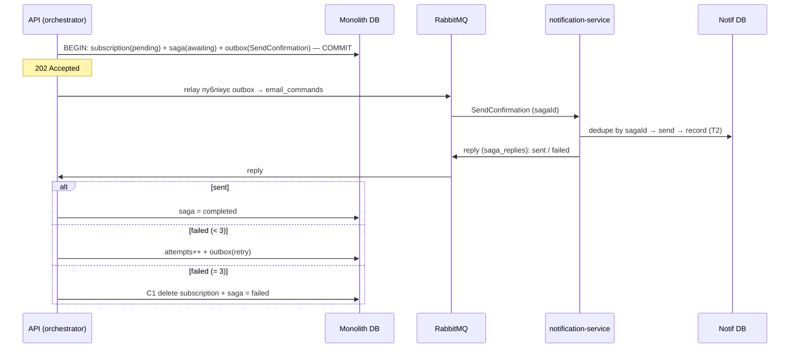

# ADR-003: Розподілена транзакція через оркестровану Saga

---

## Статус

**Статус:** Accepted
**Дата:** 2026-06-10
**Автор:** Яхній Олександр

---

## Контекст

Реєстрація підписки тепер охоплює **два сервіси з власними БД**:

- `subscriptions` (моноліт) — створює запис підписки;
- `notification-service` (окремий деплой, своя БД) — надсилає лист підтвердження й фіксує це в себе.

Бізнес-правило: підписка має сенс лише якщо лист підтвердження **вдалося надіслати** (інакше юзер ніколи не натисне посилання й не підтвердить). Тобто потрібна атомарність **між двома сервісами**.

---

## Проблема

Локальна транзакція БД охоплює лише одну базу. Як забезпечити «усе або нічого» між двома сервісами без розподіленого 2PC (блокуючий, крихкий, майже не вживається)?

---

## Розглянуті варіанти

| Варіант | Чому ні / так |
| --- | --- |
| **2PC** | блокуючий, єдина точка відмови (координатор), погано для мікросервісів — ❌ |
| **Saga (хореографія)** | децентралізовано (події), але флоу й компенсації розмазані — важче простежити |
| **Saga (оркестрація)** | центральний оркестратор керує кроками й компенсаціями; вся логіка в одному місці — ✅ (за умовою ДЗ) |

---

## Прийняте рішення

**Оркестрована Saga.** Оркестратор живе модулем у моноліті (`src/modules/saga`), зберігає стан у таблиці `saga`, і керує двома кроками:

- **T1** `subscriptions`: створити підписку (`confirmed=false`);
- **T2** `notification-service`: надіслати лист + зафіксувати в `notifications`;
- **C1** (компенсація): видалити підписку, якщо T2 остаточно не вдався.

Додаткові рішення:

- **Команда, а не подія** через мережу (notification — тупий виконавець; рішення на боці оркестратора).
- **Transactional outbox:** T1 + запис саги + вихідна команда пишуться в **одній локальній транзакції** → жодного dual-write. Окремий relay-поллер публікує outbox у RabbitMQ.
- **Ідемпотентний consumer:** notification дедуплікує за `sagaId` (його БД) — бо retry оркестратора передоставляє ту саму команду.
- **Retry + компенсація:** оркестратор рахує спроби; до **3** — повторно ставить команду в outbox; на 3-й невдачі — компенсує (C1: delete) і ставить сазі `failed`.

---

## Схема

---

## Наслідки

### Позитивні
- Атомарність між двома сервісами **без** 2PC; ніяких глобальних локів.
- Outbox прибирає dual-write на боці моноліту.
- Стан саги переживає рестарт оркестратора; consumer ідемпотентний.

### Негативні (плата за сагу)
- **Втрата ізоляції (ACID «I»):** pending-підписку видно іншим, поки сага не завершилась.
- **Eventual consistency:** результат відомий не одразу (202 → лист пізніше).
- Більше рухомих частин (черга, outbox, reply-канал).

### Відомі обмеження (next steps)
- **Reply без outbox:** notification публікує відповідь напряму; якщо впаде між «надіслав» і «опублікував reply» — reply втрачено, сага зависне в `awaiting`. Лікування: outbox і на боці notification, або **таймаут+resume** стуків у оркестраторі.
- **Relay — один інстанс:** поллер без блокувань; для кількох інстансів моноліту — `FOR UPDATE SKIP LOCKED`.
- **Компенсація = delete:** простий відкат без аудиту (свідомий вибір).
