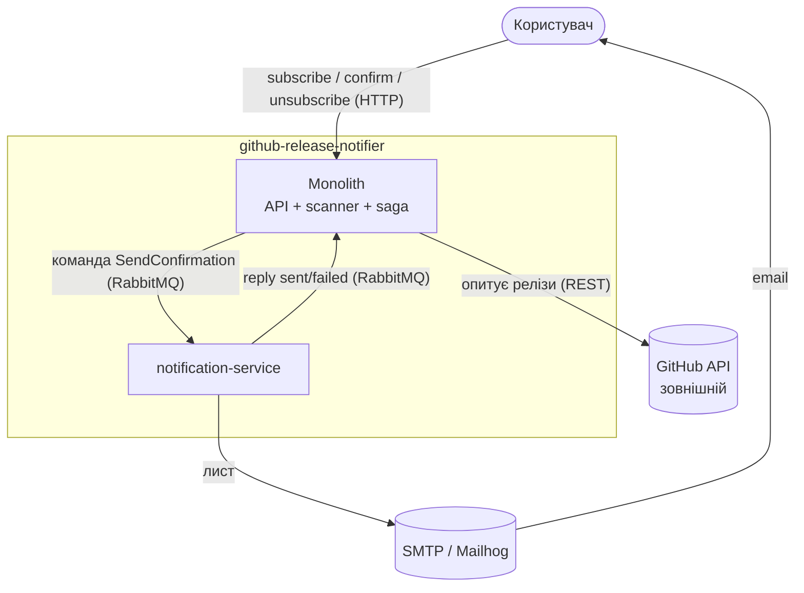
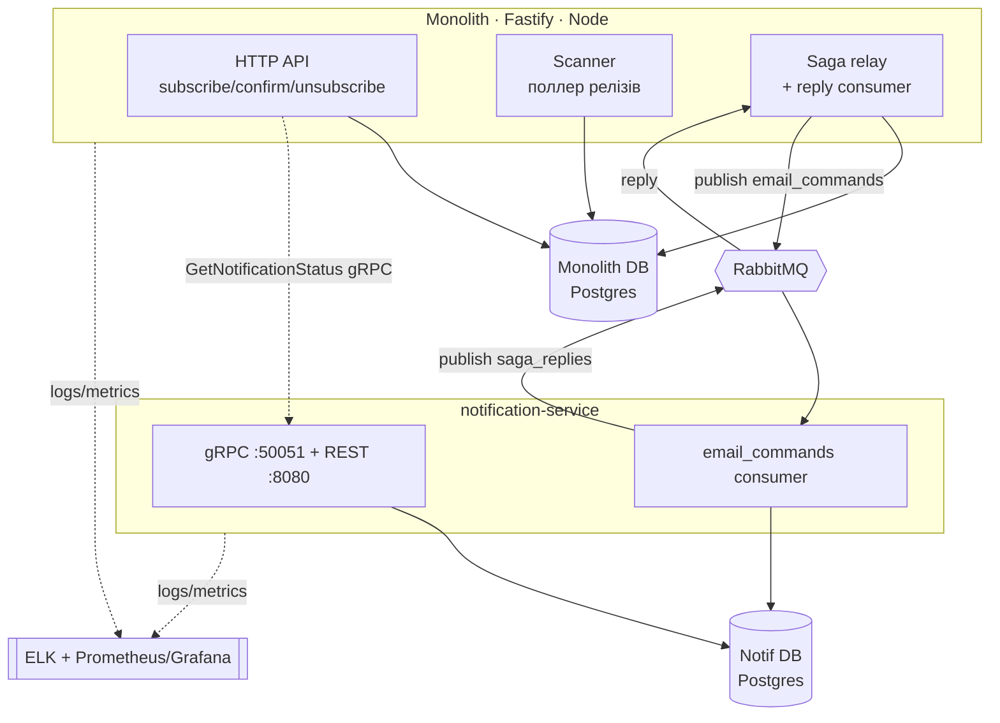
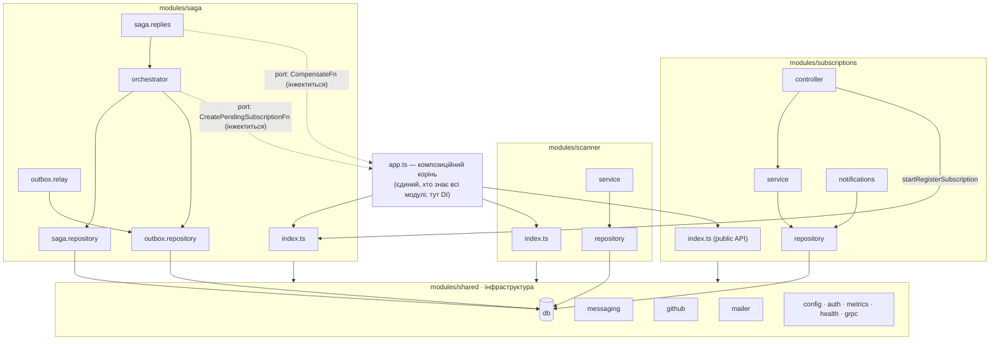
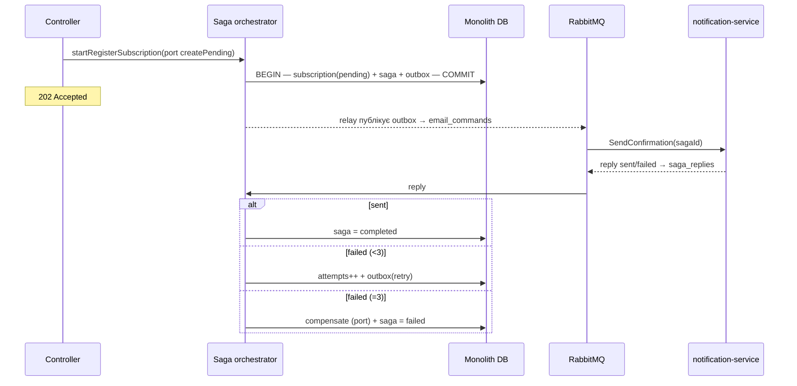

# Архітектура

Опис архітектури `github-release-notifier` за моделлю **C4** (Context → Container →
Component → Code/Runtime). Стиль застосунку — **шаруватий модульний моноліт** із
винесеним окремо `notification-service`. Правила залежностей і їх автоматична
перевірка описані в [ADR-005](./ADR-005-layered-architecture.md).

---

## Рівень 1 — Context

Хто користується системою і з чим вона говорить назовні.

**Ключове:** уся міжсервісна комунікація — асинхронна через RabbitMQ, крім одного
синхронного read-статусу `GetNotificationStatus` (gRPC, див. [ADR-004](./ADR-004-grpc.md)).

---

## Рівень 2 — Container

Розгортувані одиниці та сховища стану.

Черги: `email_commands` (команди монолітом → notification), `saga_replies`
(відповіді назад). Кожен сервіс володіє **своєю** БД — спільної таблиці немає.

---

## Рівень 3 — Component (моноліт зсередини)

Це серце ДЗ: як усередині моноліту розкладені **модулі** й **шари**, і куди
дозволено вказувати залежностям.

### Шари (згори вниз, залежності лише вниз)

| Шар | Файли | Відповідальність | Кому дозволено кликати |
| --- | --- | --- | --- |
| **Controller** | `*.controller.ts` | HTTP: валідація, статус-коди, маппінг помилок | service, public API інших модулів |
| **Service** | `*.service.ts` | бізнес-логіка, оркестрація в межах модуля | repository |
| **Repository** | `*.repository.ts` | єдиний, хто пише SQL / тримає доступ до БД | shared/db |
| **Shared** | `modules/shared/**` | інфраструктура (БД, черга, github, mailer…) | нічого з домену |

**Композиційний корінь** `app.ts` живе поза `src/modules` і є єдиним місцем, де
збираються всі залежності (Dependency Injection). Тільки йому дозволено знати всі
модулі одночасно.

### Правило залежностей

1. Залежності вказують **в один бік**: controller → service → repository → shared.
2. `shared` (інфраструктура) **ніколи** не залежить від домену.
3. Модуль спілкується з іншим модулем **лише через його `index.ts`** (публічний API),
   ніколи не тягне внутрішні файли.
4. Циклів немає. Колишній цикл `subscriptions ↔ saga` розірвано **інверсією
   залежностей**: сага не імпортує `subscriptions`, а приймає дві функції-порти
   (`CreatePendingSubscriptionFn`, `CompensateFn`), які інжектить композиційний корінь.

Усе це — не домовленість на словах, а **fitness-функції**: `npm run arch`
(dependency-cruiser) валить збірку на порушенні. Деталі й межі інструмента — в
[ADR-005](./ADR-005-layered-architecture.md).

---

## Рівень 4 — Runtime (реєстрація підписки, Saga)

Динаміка головного сценарію — оркестрована сага з transactional outbox.
Повна послідовність і рішення — в [ADR-003](./ADR-003.md):

