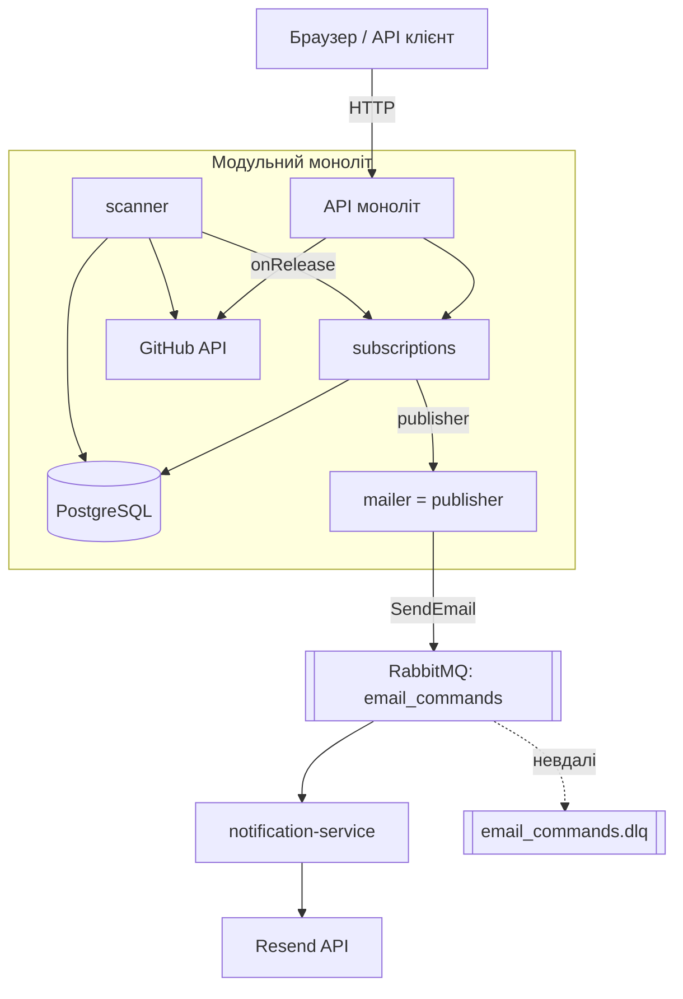
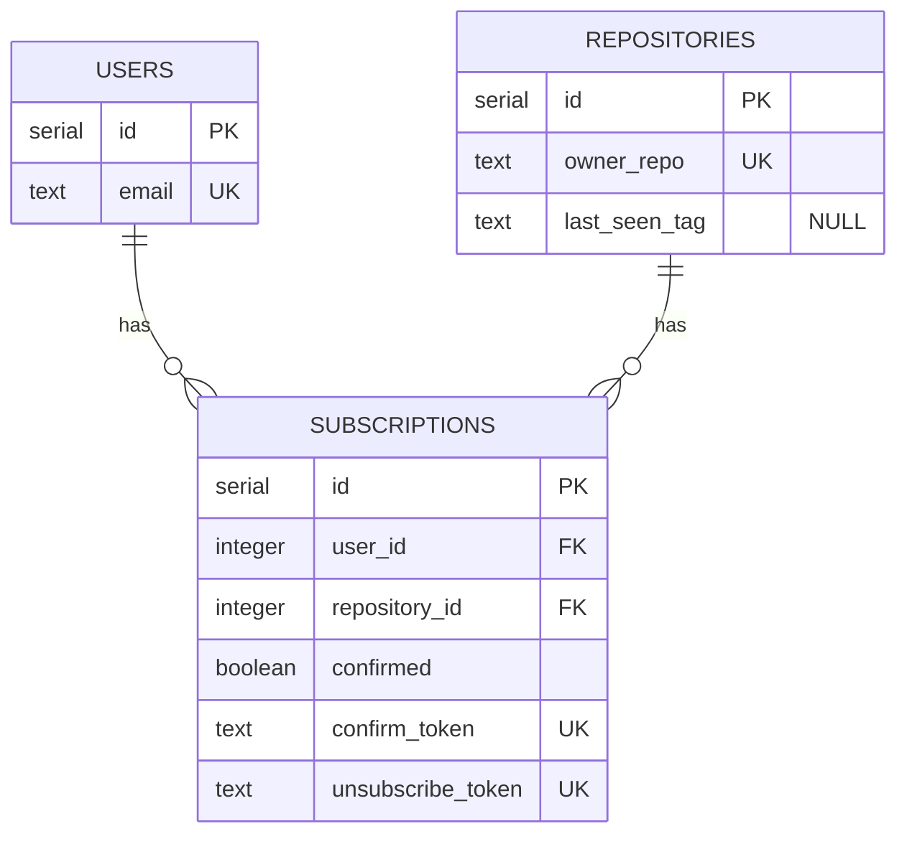
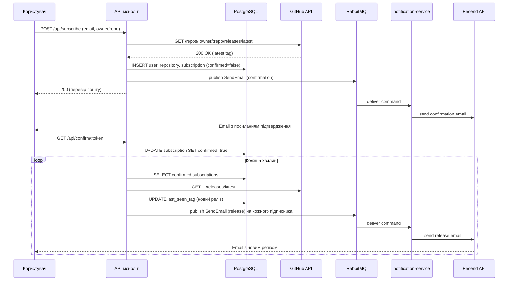

# System Design: Github Release Notifier

Проєкт створений для юзерів хто хоче отримувати на пошту листи коли виходить новий release в певному repository.

> **Архітектура (HW#7):** **модульний моноліт** (домени `subscriptions` / `scanner` / `shared`) + винесений **мікросервіс** `notification-service`, що отримує команди `SendEmail` через **RabbitMQ**. Обґрунтування рішень — у [`ADR-002.md`](ADR/ADR-002.md); деталі брокера — у [`message-broker.md`](message-broker.md).

---

## Огляд проєкту

Users, які хочуть слідкувати за новими releases від компаній в проєктах не можуть отримувати повідомлення відразу на пошту. Тож мій сервіс вирішує цю проблему. User повинен ввести свою електронну пошту та репозиторій у форматі owner/repo, та потім підтвердити на пошті відслідковування releases і отримувати їх в подальшому. Також в кожному листі user має можливість відписатись від repositories releases. Окрім того, кожен може переглянути на які репозиторії підписаний певний user, використовуючи пошту.

---

## Контекст

**Проблема:** Юзери хочуть слідкувати за новими релізами на гітхабі в проєктах але не мають можливості отримувати повідомлень

**Чому зараз:** Проєктів стає все більше й більше, тож авдиторія росте

---

## Вимоги системи

### Функціональні вимоги

- Система з інтервалом перевіряє вихід нового релізу
- Сервіс для повідомлення юзерів про новий реліз email листом
- API для керування підпискам ( перегляд, створення та видалення )

### Нефункціональні вимоги

- Доступність: ~99% (в межах можливостей хостингу)
- Час відповіді API: < 500ms
- Безпека: запобігання SQL Injections + Verification + Rate Limits
- Надійність: Best-effort доставлення в межах GitHub rate limit

### Обмеження

- 1000 запитів на годину ( Github Rate Limits )
- Не надсилаємо перший реліз відразу при підписці
- Доставка листів асинхронна через чергу (at-least-once): можливі дублі, а невдалі повідомлення паркуються в DLQ (деталі — у [`message-broker.md`](message-broker.md))
- GitHub та Resend тестуються через моки — реальна взаємодія з зовнішніми API не перевіряється

---

## Оцінка навантаження

### Користувачі та трафік

- **Активні користувачі:** ~5 (3-5 на старті)
- **Підписки на користувача:** 2-3 (середнє) → ~10-15 активних підписок
- **GitHub API запити:** ~2880/день (10 репо × перевірка кожні 5 хв × 24 год)
- **Email повідомлень:** ~10/тиждень (2 релізи × 5 підписників)

### Дані

- **Користувач:** ~150 bytes
- **Підписка:** ~200 bytes
- **Загальний обсяг:** ~1 KB/рік

### Bandwidth

- **Incoming:** ~20 KB/день
- **Outgoing:** ~10 KB/день
- **External API:** ~14 MB/день

---

## Tech Stack

| Категорія   | Технологія      |
| ----------- | --------------- |
| Мова        | TypeScript      |
| Runtime     | Node.js         |
| Фреймворк   | Fastify         |
| База даних  | PostgreSQL      |
| ORM / Query | Raw SQL (pg)    |
| Брокер черг | RabbitMQ (amqplib) |
| Email       | Resend (у notification-service) |
| GitHub API  | GitHub REST API |
| Деплой      | Docker Compose  |

---

## High-Level Architecture

---

## Компоненти системи

### Frontend

Звичайний HTML, без JS-based frameworks

---

### Backend

**Модульний моноліт** (один процес) + один винесений сервіс.

- **`subscriptions`** (ядро) — CRUD підписок, володіє БД; на новий реліз дістає підписників і публікує команди розсилки
- **`scanner`** — періодично шукає нові релізи в GitHub; знайшовши, віддає їх через колбек (не знає про підписників чи пошту)
- **`shared`** — спільне: github-клієнт (ACL), db, config, auth, metrics, messaging (RabbitMQ)
- **`notification-service`** (окремий деплой, без БД) — консьюмер черги `email_commands`: рендерить лист із шаблону й шле через Resend

---

### База даних

**БД:** PostgreSQL

**Структура бази даних**

---

### External APIs

| Сервіс     | Для чого використовується                        |
| ---------- | ------------------------------------------------ |
| Resend API | Відправка email-розсилок                         |
| GitHub API | Перевірка існування owner, repo та нових релізів |

---

## API Service (Node.js/Fastify)

**Відповідальність:**

- Обробка REST API запитів
- Валідація даних
- CRUD операції з підписками
- Інтеграція з БД
- Взаємодія з External APIs

| Метод | Endpoint                  | Опис                                             | Auth |
| ----- | ------------------------- | ------------------------------------------------ | ---- |
| POST  | `/api/subscribe`          | Підписати email на releases репозиторію          | Ні   |
| GET   | `/api/confirm/:token`     | Підтвердити підписку через токен з email         | Ні   |
| GET   | `/api/unsubscribe/:token` | Відписатись від репозиторію через токен з email  | Ні   |
| GET   | `/api/subscriptions`      | Отримати список підписок за email (`?email=...`) | Ні   |

---

## Як працює система

**Сценарій: Підписка та отримання сповіщення про реліз**

1. Користувач вводить email та репозиторій у форматі `owner/repo`
2. API валідує дані, перевіряє репозиторій у GitHub, зберігає підписку (`confirmed=false`) і **публікує команду** `SendEmail` (confirmation) у чергу
3. `notification-service` забирає команду з черги й надсилає confirmation email
4. Користувач переходить за посиланням → API оновлює підписку (`confirmed=true`)
5. Сканер кожні 5 хв шукає нові релізи для підтверджених підписок
6. На новий реліз `subscriptions` дістає підписників і публікує команду на кожного → `notification-service` надсилає лист із посиланням для відписки

---

## Перевірка функціоналу

### Як тестуємо зараз

- [x] Unit тести (моноліт): валідація, логіка підписки (транзакція, rollback, дублікати), сканер, publisher команд
- [x] Тести `notification-service`: логіка консьюмера (рендер шаблонів, dispatch команд)
- [x] Integration тести: HTTP endpoints проти реальної PostgreSQL
- [x] Наживо: підписка → черга → consumer → Resend; DLQ ловить невдалі повідомлення

### Як перевіряємо через 3 місяці

- Логи: структуровані JSON (pino) → gelf → Logstash → Elasticsearch → Kibana (моноліт і `notification-service`)
- Метрики: RED-метрики (prom-client) → Prometheus → Grafana
- Алерти: відсутні (наступний крок)

---

## Security Basics

- Секрети зберігаємо в `.env`, не в коді
- Валідація вхідних даних на сервері

---

## Deployment

| Компонент            | Де розгорнуто            |
| -------------------- | ------------------------ |
| API моноліт          | Docker                   |
| notification-service | Docker                   |
| PostgreSQL           | Docker                   |
| RabbitMQ             | Docker                   |
| Observability        | ELK + Prometheus/Grafana |
| CI/CD                | GitHub Actions           |

> Усе піднімається однією командою `docker compose up --build`.

---

## Reviewer

**Reviewer:** Мої любімі одногрупніки

---

## Deadline

**Deadline:** 2026-06-07
