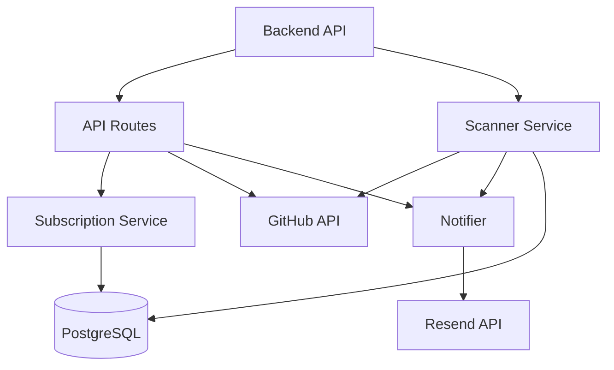
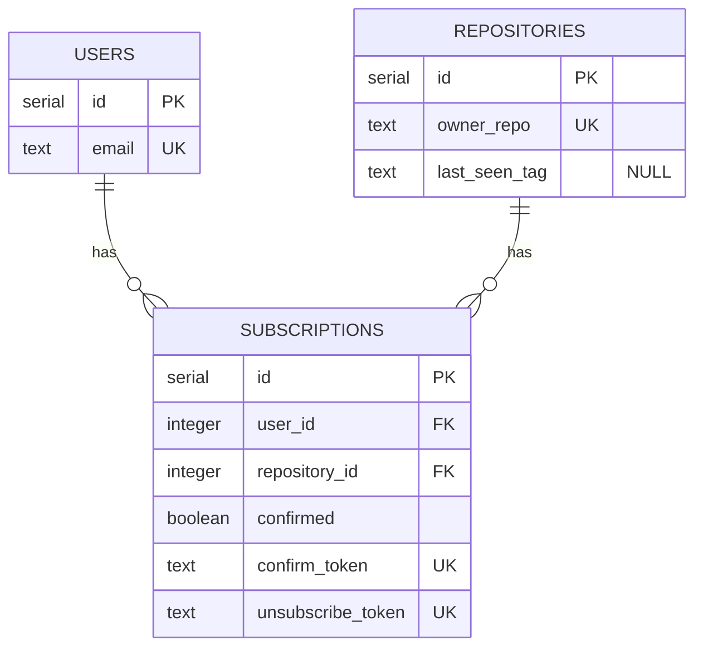
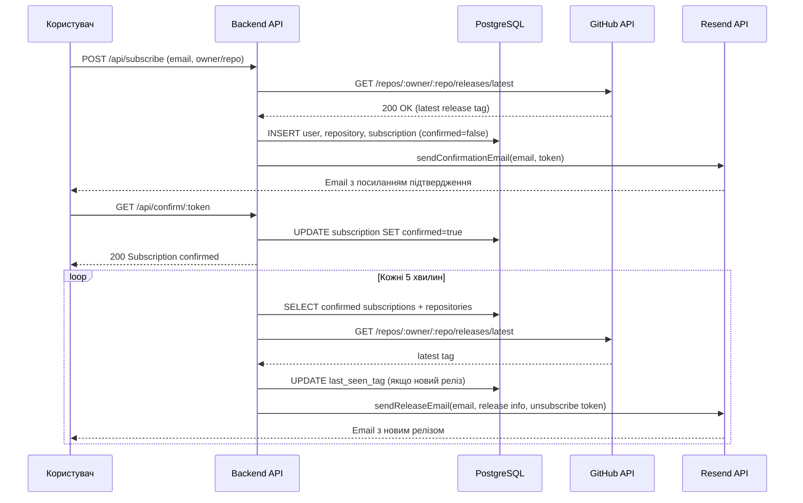

# System Design: Github Release Notifier

Проєкт створений для юзерів хто хоче отримувати на пошту листи коли виходить новий release в певному repository.

---

## Огляд проєкту

Users, які хочуть слідкувати за новими releases від компаній в проєктах не можут отримувати повідомлення відразу на пошту. Тож мій сервіс вирішує цю проблему. User повинен ввести свою електронну пошту та репозиторій у форматі onwer/repo, та потім підтвердити на пошті відслідковування releases і отримувати їх в подальшому. Також в кожному листі user має можливість відписатись від repositories releases. Окрім того, кожен може переглянути на які репозиторії підписаний певний user, використовуючи пошту.

---

## Контекст

**Проблема:** Юзери хочуть слідкувати за новими релізами на гітхабі в проєктах але не мають можливості отримувати повідомлень

**Чому зараз:** Проєктів стає все більше й більше, тож авдиторія росте

---

## Вимоги системи

### Функціональні вимоги

- Система з інтервалом перевіряє вихід нового релізу
- Сервіс для повідомлення юзерів про новий реліз email листом
- API для керування підпискам ( перегляд, створення та видалення )

### Нефункціональні вимоги

- Доступність: ~99% (в межах можливостей Railway)
- Час відповіді API: < 500ms
- Безпека: запобігання SQL Injections + Verification + Rate Limits
- Надійність: Best-effort доставлення в межах GitHub rate limit

### Обмеження

- 1000 запитів на годину ( Github Rate Limits )
- Не надсилаємо перший реліз відразу при підписці
- Trade-off після ліміту повідомлення губляться, але не дублюються
- GitHub та Resend тестуються через моки — реальна взаємодія з зовнішніми API не перевіряється

---

## Оцінка навантаження

### Користувачі та трафік

- **Активні користувачі:** ~5 (3-5 на старті)
- **Підписки на користувача:** 2-3 (середнє) → ~10-15 активних підписок
- **GitHub API запити:** ~2880/день (10 репо × перевірка кожні 5 хв × 24 год)
- **Email повідомлень:** ~10/тиждень (2 релізи × 5 підписників)

### Дані

- **Користувач:** ~150 bytes
- **Підписка:** ~200 bytes
- **Загальний обсяг:** ~1 KB/рік

### Bandwidth

- **Incoming:** ~20 KB/день
- **Outgoing:** ~10 KB/день
- **External API:** ~14 MB/день

---

## Tech Stack

| Категорія   | Технологія      |
| ----------- | --------------- |
| Мова        | TypeScript      |
| Runtime     | Node.js         |
| Фреймворк   | Fastify         |
| База даних  | PostgreSQL      |
| ORM / Query | Raw SQL (pg)    |
| Email API   | Resend API      |
| GitHub API  | GitHub REST API |
| Деплой      | Railway         |

---

## High-Level Architecture

---

## Компоненти системи

### Frontend

Звичайний HTML, без JS-based frameworks

---

### Backend

Звʼязує між собою 3 сервіси логіки, поєднує два з них ( scanner and subscription ) до БД.

**Основні сервіси:**

- `Scanner` — Пошук нових релізів відповідно до confirmed subscription та repositories
- `Notifier` — Сервіс відправлення емейлів на пошту
- `Subscription` — API для керування підписками

---

### База даних

**БД:** PostgreSQL

**Структура бази даних**

---

### External APIs

| Сервіс     | Для чого використовується                        |
| ---------- | ------------------------------------------------ |
| Resend API | Відправка email-розсилок                         |
| GitHub API | Перевірка існування owner, repo та нових релізів |

---

## API Service (Node.js/Fastify)

**Відповідальність:**

- Обробка REST API запитів
- Валідація даних
- CRUD операції з підписками
- Інтеграція з БД
- Взаємодія з External APIs

| Метод | Endpoint                  | Опис                                             | Auth |
| ----- | ------------------------- | ------------------------------------------------ | ---- |
| POST  | `/api/subscribe`          | Підписати email на releases репозиторію          | Ні   |
| GET   | `/api/confirm/:token`     | Підтвердити підписку через токен з email         | Ні   |
| GET   | `/api/unsubscribe/:token` | Відписатись від репозиторію через токен з email  | Ні   |
| GET   | `/api/subscriptions`      | Отримати список підписок за email (`?email=...`) | Ні   |

---

## Як працює система

**Сценарій: Підписка та отримання сповіщення про реліз**

1. Користувач вводить email та репозиторій у форматі `owner/repo`
2. Сервер валідує дані, перевіряє існування репозиторію через GitHub API, зберігає підписку (`confirmed=false`) та відправляє confirmation email
3. Користувач отримує email з посиланням підтвердження
4. Користувач переходить по посиланню → сервер оновлює підписку (`confirmed=true`) в БД
5. Сканнер кожні 5 хв запитує GitHub API на нові релізи для всіх підтверджених підписок
6. При новому релізі Notifier відправляє email з деталями релізу та посиланням для відписки

---

## Перевірка функціоналу

### Як тестуємо зараз

- [x] Unit тести: валідація email та repo форматів, логіка підписки (транзакція, rollback, дублікати), формування та відправка email листів, сканування нових релізів
- [x] Integration тести: HTTP endpoints — коректні статус-коди та відповіді при різних сценаріях підписки
- [x] Ручне тестування: підписка через UI форму, підтвердження email, отримання notification при новому релізі

### Як перевіряємо через 3 місяці

- Моніторинг: відсутній — Railway надає базовий uptime статус
- Логи: Fastify пише структуровані JSON логи в stdout, доступні через Railway dashboard
- Алерти: відсутні
- Метрики: відсутні

---

## Security Basics

- Секрети зберігаємо в `.env`, не в коді
- Валідація вхідних даних на сервері

---

## Deployment

| Компонент  | Де розгорнуто    |
| ---------- | ---------------- |
| Backend    | Railway (Docker) |
| База даних | Railway (Docker) |
| CI/CD      | GitHub Actions   |

---

## Reviewer

**Reviewer:** Мої любімі одногрупніки

---

## Deadline

**Deadline:** 2026-05-08
